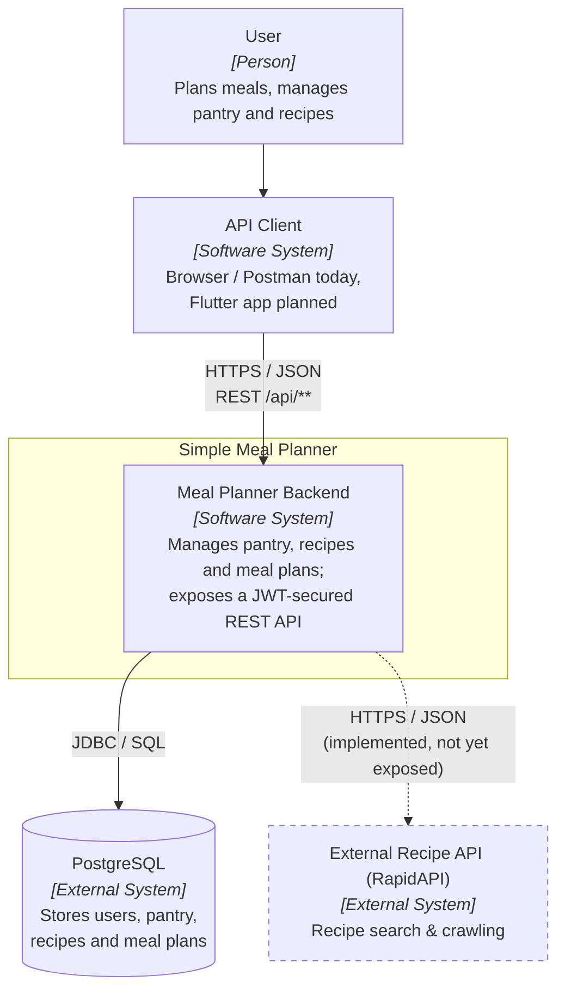

# C1 – System Context

Shows the Simple Meal Planner backend as a single box, the people/clients that use
it, and the external systems it depends on.

Dashed elements are planned or not yet wired up (see [README legend](README.md#legend)).

## Elements

| Element | Type | Notes |
|---------|------|-------|
| User | Person | Interacts through an API client. |
| API Client | Software System | Currently browser/Postman; a Flutter frontend is planned ([ADR 001](../adr/001_use_flutter_as_frontend.md)) but not present in this repo. |
| Meal Planner Backend | Software System | Spring Boot application, all endpoints under `/api/**`; `/api/auth/**` is public, the rest require a JWT. |
| PostgreSQL | External System | Relational persistence; schema managed by Flyway. |
| External Recipe API | External System | Reached via `RecipeApiClient`; the client and `RecipeAPIService` exist but are **not called by any controller yet** — drawn dashed. |
