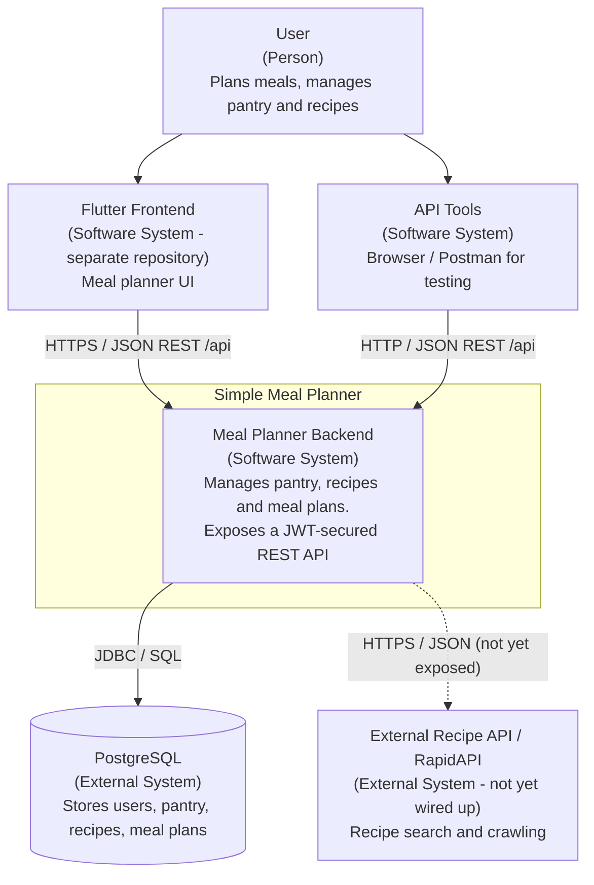

# C1 – System Context

Shows the Simple Meal Planner backend as a single box, the people/clients that use
it, and the external systems it depends on.

Dashed arrows / `[not yet wired up]` labels mark parts that are implemented but not yet
exposed (see [README legend](README.md#legend)).

## Elements

| Element | Type | Notes |
|---------|------|-------|
| User | Person | Interacts through the Flutter frontend (or API tools). |
| Flutter Frontend | Software System | The meal planner UI ([ADR 001](../adr/001_use_flutter_as_frontend.md)). Exists and is maintained in a **separate repository**; consumes this backend's REST API. |
| API Tools | Software System | Browser/Postman used to exercise the API directly during development. |
| Meal Planner Backend | Software System | Spring Boot application, all endpoints under `/api/**`; `/api/auth/**` is public, the rest require a JWT. |
| PostgreSQL | External System | Relational persistence; schema managed by Flyway. |
| External Recipe API | External System | Reached via `RecipeApiClient`; the client and `RecipeAPIService` exist but are **not called by any controller yet** — drawn dashed. |
