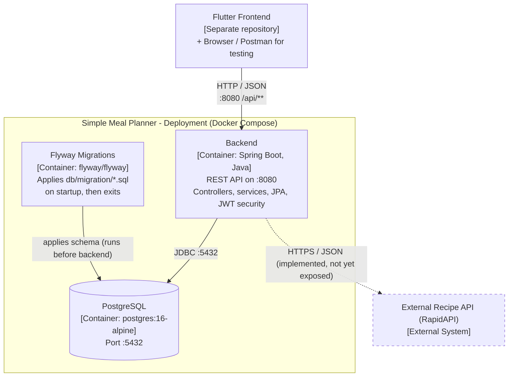

# C2 – Container

Zooms into the Simple Meal Planner system and shows its deployable units and how they
communicate. Derived from `compose.yaml`, `Dockerfile` and the Spring configuration.

Dashed elements are planned or not yet wired up (see [README legend](README.md#legend)).

## Containers

| Container | Technology | Responsibility |
|-----------|------------|----------------|
| Backend | Spring Boot (Java), packaged via `Dockerfile`, `SPRING_PROFILES_ACTIVE=docker` | Serves the REST API on port 8080; contains all application logic. |
| Flyway Migrations | `flyway/flyway:10` | Runs `migrate` against PostgreSQL before the backend starts (`depends_on: service_completed_successfully`), mounting `src/main/resources/db/migration`. |
| PostgreSQL | `postgres:16-alpine` | Persistent store on port 5432; healthcheck gates the other containers. |

## Notes

- Startup order in `compose.yaml`: **postgres (healthy) → flyway (completed) → backend**.
- The backend also runs migrations/seed logic at boot via `DataLoader` (default user)
  and `DatabaseAutofillerService` (`CommandLineRunner`); see the component diagram.
- The external recipe API is a separate concern and is drawn dashed because no
  container/endpoint currently calls it.
