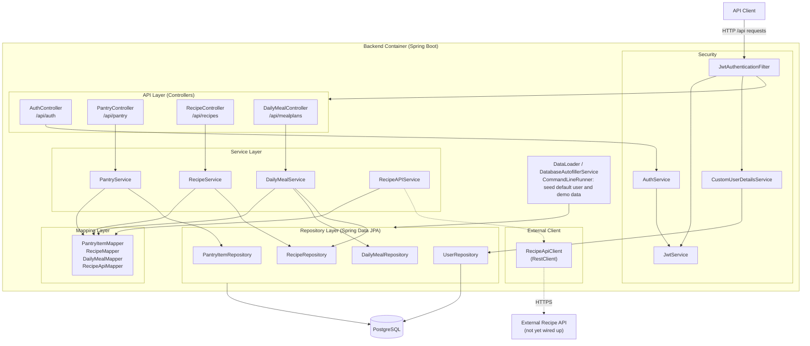

# C3 – Component (Backend)

Zooms into the Backend container and shows its components grouped by architectural
layer ([ADR 004](../adr/004_layered_architecture.md)). Requests enter through the
security filter, reach a controller, are handled by a service, mapped between DTOs and
entities ([ADR 008](../adr/008_introduce_mapping_layer.md)) and persisted through a
repository.

Dashed elements are implemented but not yet wired up (see [README legend](README.md#legend)).

## Layers and components

| Layer | Components | Responsibility |
|-------|-----------|----------------|
| Security | `JwtAuthenticationFilter`, `JwtService`, `CustomUserDetailsService`, `AuthService`, `SecurityConfig` | Stateless JWT auth; `/api/auth/**` public, all other `/api/**` require a valid bearer token ([ADR 010](../adr/010_user_authentication_model.md)). |
| API (Controllers) | `AuthController`, `PantryController`, `RecipeController`, `DailyMealController` | Map HTTP endpoints to services; accept/return DTOs only. |
| Service | `PantryService`, `RecipeService`, `DailyMealService`, `AuthService`, `RecipeAPIService`, `ConfigService`, `PasswordService` | Business logic; orchestrate mappers and repositories. |
| Mapping | `PantryItemMapper`, `RecipeMapper`, `DailyMealMapper`, `RecipeApiMapper` | Convert between request/response DTOs and entities. |
| Repository | `PantryItemRepository`, `RecipeRepository`, `DailyMealRepository`, `UserRepository` | Spring Data JPA persistence; `RecipeRepository` also has `findAvailableRecipes()`. |
| External client | `RecipeApiClient` | `RestClient` wrapper for the RapidAPI recipe API — **implemented, not yet reachable via any controller** (dashed). |
| Bootstrap | `DataLoader`, `DatabaseAutofillerService` | `CommandLineRunner` beans that seed the default user and demo data on startup. |

## Notes

- `DailyMealService` depends on both `DailyMealRepository` and `RecipeRepository`
  (a meal plan references breakfast/lunch/dinner recipes).
- `RecipeAPIService` / `RecipeApiClient` and their `RecipeAPIService → RecipeApiMapper`
  path are shown dashed: the code exists but no controller currently calls them.
