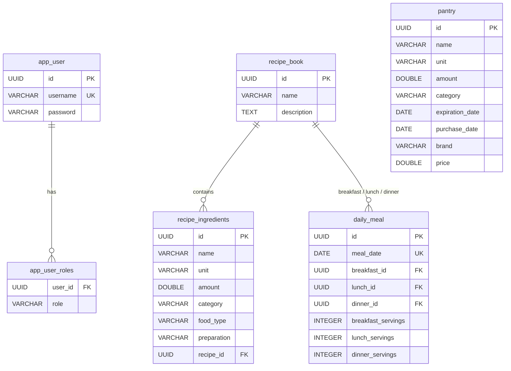

# Data Model (ER)

Relational schema created by the Flyway migrations in
`src/main/resources/db/migration/`. This is supplementary to the C4 diagrams and
documents persistence, not runtime structure.

## Relationships

- `app_user` 1—* `app_user_roles` — a user's roles (`@ElementCollection`), FK cascades on delete.
- `recipe_book` 1—* `recipe_ingredients` — a recipe's ingredients, FK cascades on delete.
- `recipe_book` 1—* `daily_meal` — each `daily_meal` references up to three recipes
  (`breakfast_id`, `lunch_id`, `dinner_id`), each a nullable FK to `recipe_book(id)`.
- `pantry` is standalone (current stock); not linked by FK to recipes.

## Notes

- `PantryItem` and `RecipeIngredient` both extend the `@MappedSuperclass` `Ingredient`,
  so they share the `name`/`unit`/`amount`/`category` columns but map to separate tables.
- `daily_meal.meal_date` is `UNIQUE` — one meal plan per date.
- Keep this diagram in sync when adding a new migration under `db/migration/`.
