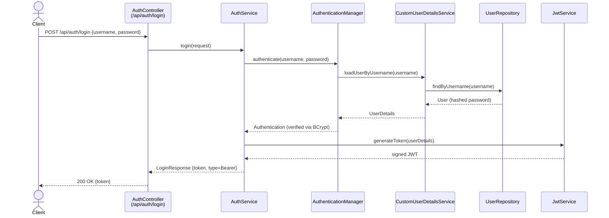
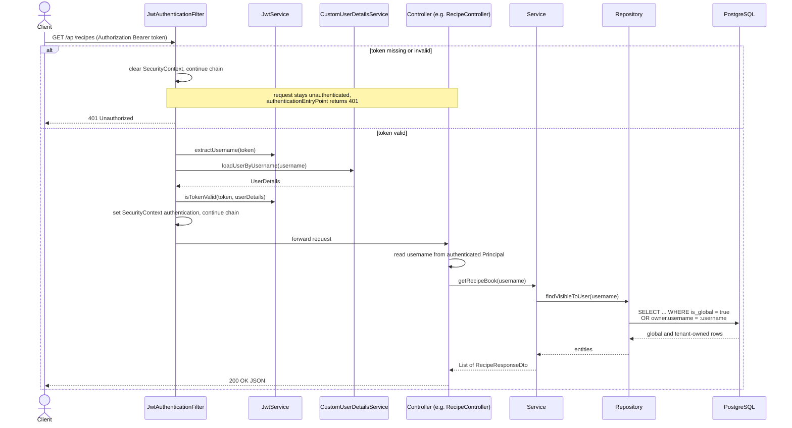

# Sequence – Authentication, tenant authorization & protected request

Shows the two core runtime flows of the security layer and the tenant-authorization seam
([ADR 010](../adr/010_user_authentication_model.md)):

1. Login: exchange credentials for a JWT.
2. Access a protected endpoint using that JWT and restrict data access to the authenticated tenant.

`SecurityConfig` makes `/api/auth/**` public and requires authentication for all other
`/api/**`; sessions are stateless.

## 1. Login

## 2. Tenant-scoped protected request

## Notes

- The filter runs before `UsernamePasswordAuthenticationFilter`
  (`addFilterBefore` in `SecurityConfig`).
- On a missing/invalid token, the configured `authenticationEntryPoint` returns
  `401 Unauthorized`.
- Authentication identifies the caller; tenant authorization determines which records that caller may access.
- Controllers derive the tenant identity exclusively from the authenticated `Principal`. Request bodies and path
  parameters must not select an owner.
- Services pass that identity through the tenant seam, and repositories use owner-scoped or visibility-scoped queries.
  Unscoped calls such as `findAll()`, `findById()`, and `deleteById()` must not be used for tenant-owned data.
- Regular users may read their own and explicitly global records. Writes create private records owned by the
  authenticated user, and inaccessible foreign records are reported as `404 Not Found`.
- Passwords are stored as BCrypt hashes (`PasswordEncoder` bean); default token
  lifetime is configurable in `application.properties`.
